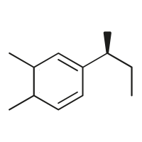

# black-teste
HTML
<!DOCTYPE>
<html>
<head lag="pt-br">
	<link rel="stylesheet" type="text/css" href="style2.css">
	<meta charset="utf-8">
	<title> Meu perfil </title>
</head>

	<body>
		<header class="container">
			

				
				<tr> <a href="#logomarca">
Início
</a> 
				<a href="#div_segunda">
Sobre mim
</a> 
				<a href="#div_terceira">
Hobbies
</a>  </tr>
			

		</header>
			<section class="container">
				

					  
Osman Mancio 	
 
				
					

			
				
 
					
 
 Olá, me chamo Osman Nascimento Mancio, muito conhecido como Osmancio. Atualmente, estou cursando Bacharelado de Ciência e Tecnologias na Universidade Federal do Rio Grande do Norte (UFRN) e tenho um grande interesse em áreas de tecnologia e ciência, como também, aberto para aprender mais sobre progamação e design.  

					
					
					
 <strong> "A mente que se abre a uma nova idéia jamais retornará ao seu tamanho original" - Albert Einstein </strong>
 
 
					

				

				
				

					<h2>SOBRE MIM</h2> 
Recém chegado do interior do Rio Grande do Norte, viví toda minha infância e adolescencia no município de Carnaubais, onde me tornei o ser humano que sou hoje, graças aos meus pais. Desde pequeno levava jeito para empilhar com bloquinhos de Lego, percebía tudo quando está ao meu alcance posso construí-las e  modificá-las quando preciso, levei essa interrelação para toda a minha vida quanto Ser sociável. No Ensino Médio, nas viagens de amostra de profissões na UFRN, ficava adimirado pela grandiosidade e complexidade da instituição (que eu não sonhava que existía), e dizía: "Vou estudar aí!", até que atualmente consegui a minha vaga tão desejada na Universidade, cursando Ciência e Tecnologias. 
 
				

				

 
					<h2> HOBBIES </h2>
					
 Desde interações neuroquímicas do corpo até a comunicação social com a natureza:  

					
 (Passe o mouse) 

					<table>
						<tr> 
							<th>  </th>
						 
							<th>  </th> 
						 
							<th>  </th> 
						</tr>
						<tr> 
							<th>  </th>
						 
							<th>  </th> 
						 
							<th>  </th> 
						</tr>
						<tr> 
							<th>  </th>
						 
							<th>  </th> 
						 
							<th>  </th> 
						</tr>
					</table>
				

			</section>

		<footer class="container"> 
			

					

						

						

			

			

				<h1>
				 ProSEmpre - EJECT © 2020 | Desenvolvido por Osman Mancio  
				</h1>
			

		</footer>

	</body>
CSS

/* Página de apresentação do participante */
/*TAG*/
p{
	color: black;
	text-shadow: 10px 10px 10px #111111
	font-size: 16px;
	font-weight: bolder;
	font-family: helvetica, arial;
	margin:  5px;
}

body{
	padding: 1px;
	font-size:: 62.5%;
	background-color: powderblue;
}

img {
	max-width: 100%;
}

*{
	margin: 0px;
	padding: 0px;
}

header{
	clear: both;
	padding: 1px;
	background-color: white;
	font-family: helvetica;
	font-size: 12px;
	position: fixed;
	background-size: 120px;
	min-inline-size: -webkit-fill-available;
	box-shadow: 0px 6px 28px 0 rgba(0, 0, 0, 0.466); 
	}

footer{
	clear: both;
	background-color: white;
	min-height: 10px;
	text-align: center;
}

h1{
	text-align: center;
	font-size: 18px;
	font-family: helvetica, arial;
}

h2{
	font-family: helvetica;
	text-align: center;
}
/* Onde irá ficar os hobbies em ícones */
table{
	margin: auto;
}

th{
	padding: 0 100px ;
}

strong{
	font-size: 30px;
	font-family: helvetica;
}
/*ID*/
#menu{
	border-radius: 50%;
	margin-top: 40px;
	float: center;
}

#navegador{
	float: left;

}

#navegador a{
	text-decoration: none;
}

#logomarca{
	float: center;
	font-family: helvetica;
	font-size: 50px;
	text-align: center;
	margin: 25px 10px;
	margin-top: 100px;

} 
#logomarca img{
	box-shadow: 1px 1px 30px 1px black;
}

#logomarca p{
	text-shadow: : 1px 1px 30px red;
	font-weight: initial;
}
#div_primeira{
	clear: both;	
	background-color: ;
	width: auto;
	min-height: 100px;
	margin:  5px 0px 5px 0px;
	padding: 0px;
	text-align: center;
	box-shadow: 
}

#div_segunda{
	clear: both;	
	background-color: #6959CD;
	width: auto;
	min-height: 100px;
	margin:  30px 0px 30px 0px;
	padding: 0px;
	text-align: center;
	box-shadow: 0px 0px 28px 0 rgba(0, 0, 0, 5);
}

#div_terceira{
	background-color: #008B8B;
	width: auto;
	min-height: 420px;
	margin:   7px 0px 30px 0px;
	padding: 0px;
	text-align: center;
	font-size: 17px;
	box-shadow: 0px 0px 28px 0 rgba(0, 0, 0, 5);
}

/*CLASS*/
.container{
	width: 1128px;
	margin: 0 auto;
}

.foto-osman{
	border-radius: 50%;
}

/* efeitos */
.circulo{
	margin: 2px;
	overflow: hidden;
	float: left;
	transition: 1s ;
	padding: 20px;
}
.circulo:hover{
	transform: rotateY(360deg);
}
